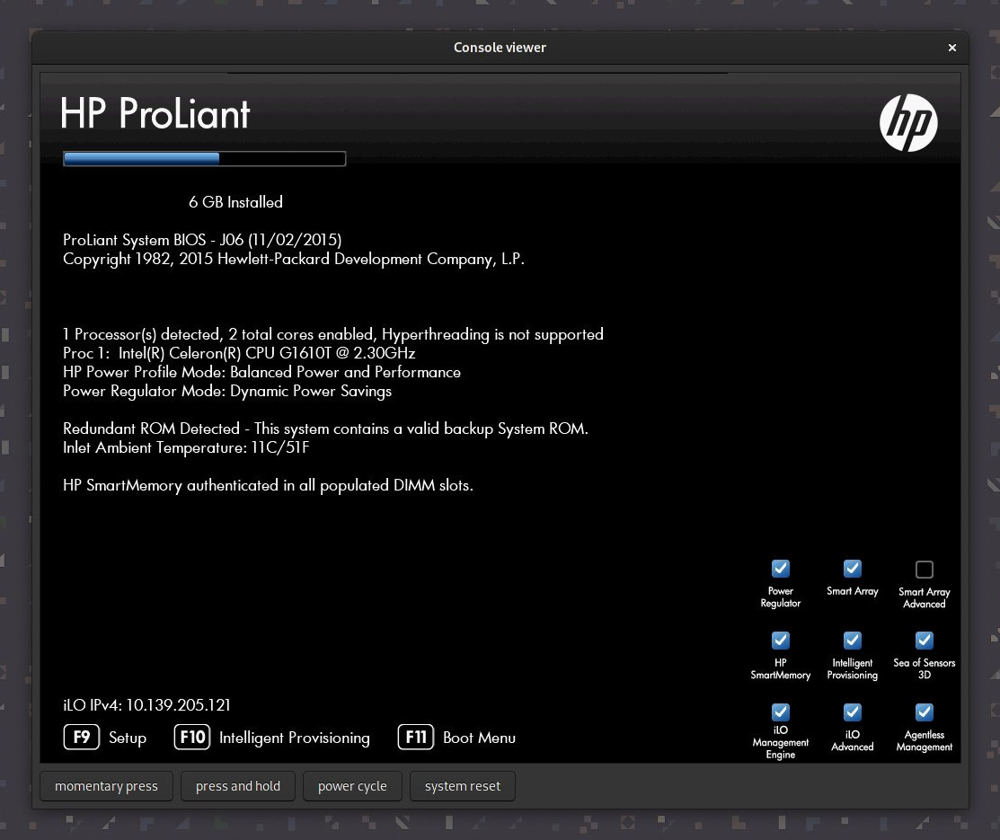

# ilo-protocol

Node.js module to interact with iLO (Integrated Lights-Out) modules in HPE
servers. iLO 4 v2.55 (and possibly other versions) are supported.

~~~ bash
npm install ilo-protocol
~~~

**[💡 Examples](#examples)** &nbsp;•&nbsp; **[📚 API reference](https://ilo-protocol.alba.sh/docs/modules.html)**

The focus is on implementing the **remote console protocol**, which
allows you to manage the server as if you were sitting at the KVM.
You can:

 - See the server's screen
 - Use the keyboard / mouse
 - Virtual media: mount a file / device from your computer
   that the server will see as a real SCSI device (hard drive,
   CDROM or floppy disk)
 - Press the power button, trigger a power cycle or system reset

In addition to implementing the protocol itself, the repository also comes with a fully-functional client in its examples, see [examples](#examples).

## Protocol overview

### Initiation

First, the `/json/rc-info` endpoint in the HTTPS webserver is called.
Like the whole API, it's authenticated with a 16-byte *session key*.
It returns, among other things:

 - the network ports to connect to
   - remote console port
   - virtual media port
 - the main *encryption key* to use for the session
 - list of supported extra protocol features

From there the protocol itself starts. The client opens a TCP
connection to the remote console port. It initiates a handshake to
negotiate a **remote console session**, where the client authenticates
to the server by sending the *session key* mentioned before,
optionally (sort of) XOR-ed with the *encryption key*.

The server may reject the session because of several reasons (no
license, wrong authentication, no free sessions, etc.), or it may
accept it. If accepted, but another session is in progress, busy
negotiation occurs. There's the option to *share* the session with
the other user, or *seize* it from them. Seizing requires confirmation
from the other user.

After that, another connection is opened to the same port, but a
slightly different handshake is used which negotiates a **command
session**. That session doesn't seem to be of much use so we'll
focus on the remote console session from now on.

### Server data (video stream)

TODO: document protocol

[State graph](./tools/graph.pdf)

### Client data (user input)

TODO: document protocol

### Encryption

Once the handshake is over, the server may choose to switch the
remote console session into RC4, AES128 or AES256 encryption. The
encryption only applies to the
remote console session, to both server and client data.
**Other sessions, like the command session or virtual media
traffic (data read / written) are not encrypted**, at least
in the implemented version.

The ciphers are always used as stream ciphers, i.e. block cyphers
are used in OFB mode.

### Virtual media

TODO: document protocol

## WebSocket support

Newer versions of the iLO (FIXME: document which) come with an **HTML5 client** rather than a Java applet.  
This client uses exactly the same protocols, but over **WebSockets** rather than TCP connections.

That's very nice because if the webserver uses HTTPS (which it does by default) those WebSockets will also go over TLS which means we finally got decent security!
The iLO doesn't use the in-protocol encryption mentioned above when the remote console session is over WebSockets.

TODO: document websocket endpoints, add support in API, make examples prefer WS when possible.

## Usage

This library only has some dependency on Node.js APIs (streams and crypto)
but is designed to be relatively easy to run in the browser.

Only the protocol itself is implemented; the user must handle
decoded data, render it to the screen, listen to user input, and even
network and filesystem I/O. The only exception is the `rest` module,
which uses [Got](https://github.com/sindresorhus/got) to make HTTPS
requests.

The modules are structured as follows (internal APIs omitted):

 - [**`rest`**: partial client for the REST API](https://ilo-protocol.alba.sh/docs/modules/rest.html)

 - **`rc/`**: implements the remote console session
   - [**`rc/handshake`**: initial handshake](https://ilo-protocol.alba.sh/docs/modules/rc_handshake.html) (authentication, busy negotiation)
   - [**`rc/telnet`**: outer layer](https://ilo-protocol.alba.sh/docs/modules/rc_telnet.html) that kicks in after the handshake (processes client & server data, mostly encryption)
   - [**`rc/video`**: decodes the video stream from `telnet`](https://ilo-protocol.alba.sh/docs/modules/rc_video.html)
   - [**`rc/command`**: formats commands sent to the server](https://ilo-protocol.alba.sh/docs/modules/rc_command.html), both in the handshake and afterwards (through `telnet`)

 - **`vm/`**: implements the virtual media sessions
   - [**`vm/handshake`**: initial handshake](https://ilo-protocol.alba.sh/docs/modules/vm_handshake.html)
   - [**`vm/scsi`**: protocol implementation](https://ilo-protocol.alba.sh/docs/modules/vm_scsi.html),
     simulates SCSI device behavior (for now, only CDROM is supported)

## Examples

The `examples` directory contains many examples of using the library.

### [`app.ts`](./examples/app.ts)

It's a completely functional GTK-based client, and it shows usage of (almost)
all protocol features.  
To try it out:

~~~ bash
npm install
$(npm bin)/ts-node examples/app.ts <arguments>
~~~

**Note:** It's currently hardcoded to assume Linux (evdev) keycodes,
so keyboard input probably won't work correctly on other OSes, or
ancient Linux installs.

**Note:** This example depends on [romgrk/node-gtk#252](https://github.com/romgrk/node-gtk/pull/252),
`package.json` already installs that branch from my repo, but you
need to do `npm explore node-gtk -- npm run build:full` after
`npm install` to make sure it picks up the changes.

### [`vm_cdrom.ts`](./examples/vm_cdrom.ts)

Simple program that mounts the supplied file as a CDROM device.  
To try it out:

~~~ bash
npm install
$(npm bin)/ts-node examples/vm_cdrom.ts <arguments>
~~~
